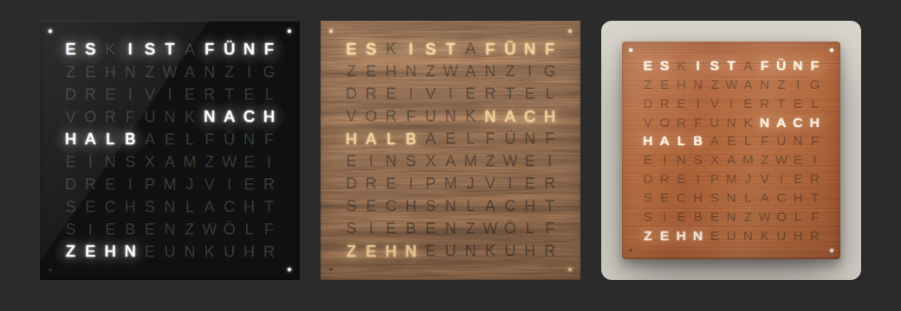
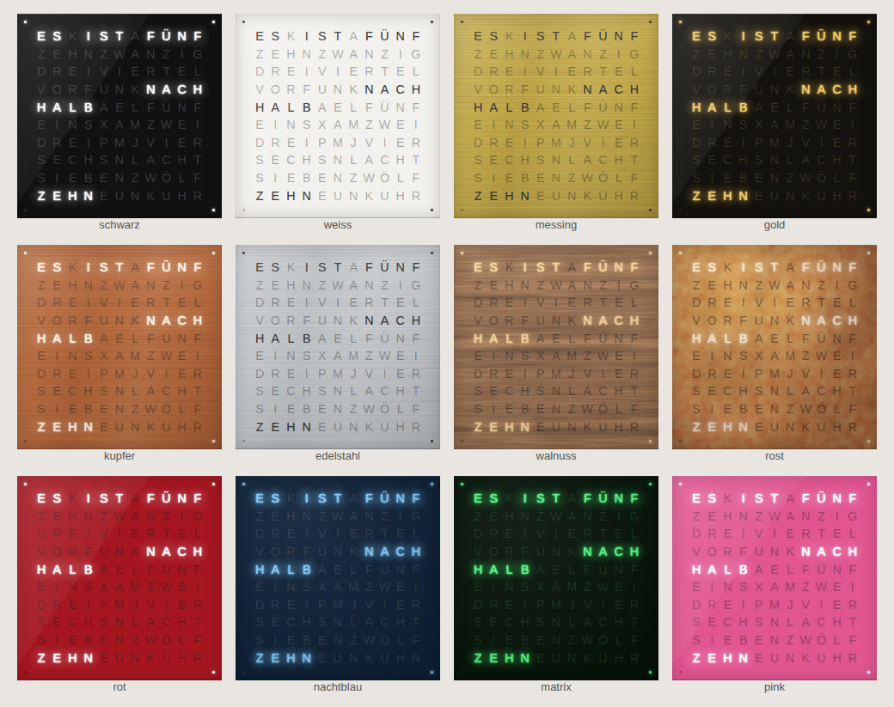

# Clock in Letters – Wortuhr für Home Assistant

Eine Lovelace-Karte als Wortuhr: Die Uhrzeit wird in leuchtenden
deutschen Wörtern in einem 11×10-Buchstabenraster angezeigt. Vier Punkte in den
Ecken zeigen die Minuten zwischen den 5-Minuten-Schritten an.



*(Schwarz Hochglanz, Walnuss und Kupfer an der Wand – jeweils um 21:38 Uhr:
„ES IST FÜNF NACH HALB ZEHN“ + 3 Punkte)*

## Installation

### Manuell

1. `clockinletters-card.js` nach `/config/www/clockinletters-card.js` kopieren.
2. In Home Assistant: **Einstellungen → Dashboards → ⋮ → Ressourcen → Ressource hinzufügen**
   - URL: `/local/clockinletters-card.js`
   - Typ: **JavaScript-Modul**
3. Browser neu laden (ggf. Cache leeren).

### Über HACS (als benutzerdefiniertes Repository)

In HACS **⋮ → Benutzerdefinierte Repositories** öffnen,
`https://github.com/renespeaker/ha-clockinletters` mit Typ **Dashboard** hinzufügen
und die Karte installieren. (Das Repo ist nicht in der HACS-Standardliste.)

## Verwendung

Im Dashboard **Karte hinzufügen → „Clock in Letters“** auswählen. Der
Karten-Editor hat aufklappbare Menüs, in denen du alles einstellen kannst:

- **Schrift** – Schriftart (Auswahlliste oder eigener Name), Schriftgröße, Schriftstärke
- **Material & Look** – realistische Darstellung (Oberflächenstruktur, Lichtreflex,
  LED-Leuchten, das auf die Platte strahlt), Oberfläche (Hochglanz, gebürstetes
  Metall, Matt, Holz, Rost) und Wandmontage mit Schatten
- **Farb-Vorlage** – Schwarz, Weiß, Messing, Gold auf Schwarz, Kupfer, Edelstahl,
  Walnuss, Rost, Rot, Nachtblau, Matrix, Pink oder die Farben deines Home-Assistant-Themes
- **Farben** – Farbwähler für aktive und inaktive Buchstaben und den Hintergrund,
  Deckkraft der inaktiven Buchstaben, Leucht-Effekt und dessen Stärke
- **Anzeige** – Minuten-Punkte, „ES IST“, abgerundete Ecken, Innenabstand
- **Sprechweise** – „Viertel nach / vor“ oder „Viertel / Dreiviertel“,
  „Zwanzig nach“ oder „Zehn vor halb“

Oder per YAML:

```yaml
type: custom:clockinletters-card
```

Beispiel mit eigenen Einstellungen:

```yaml
type: custom:clockinletters-card
font_family: Josefin Sans
font_size: 120
font_weight: "600"
color_on: [120, 200, 255]
off_opacity: 10
background: [10, 25, 45]
glow_strength: 60
```

## Farb-Vorlagen



```yaml
type: custom:clockinletters-card
theme: kupfer
wall_mount: true
```

## Optionen

| Option          | Standard          | Beschreibung |
|-----------------|-------------------|--------------|
| `theme`         | `schwarz`         | Farb-Vorlage: `schwarz`, `weiss`, `messing`, `gold`, `kupfer`, `edelstahl`, `walnuss`, `rost`, `rot`, `nachtblau`, `matrix`, `pink`, `ha` (Farben des HA-Themes) oder `eigene`. Einzeln gesetzte Farben überschreiben die Vorlage. |
| `realistic`     | `true`            | Realistische Darstellung: Oberflächenstruktur, Lichtreflex, Kanten und LED-Leuchten |
| `finish`        | `auto`            | Oberfläche: `auto` (passend zur Vorlage), `glanz`, `gebuerstet`, `matt`, `holz`, `rost`, `flach` |
| `wall_mount`    | `false`           | Uhr hängt mit Schatten auf der Karte wie an der Wand (Kartenhintergrund = Wand) |
| `font_family`   | `Helvetica Neue`  | Schriftart: `Helvetica Neue`, `Roboto`, `Arial`, `Verdana`, `Trebuchet MS`, `Georgia`, `Times New Roman`, `Courier New` oder eine Google-Schrift (`Josefin Sans`, `Montserrat`, `Raleway`, `Poppins`, `Oswald`, `Quicksand`, `Comfortaa`, `Orbitron`, `Playfair Display`, `Roboto Mono`). Auch jeder andere CSS-Schriftname ist möglich. |
| `font_size`     | `100`             | Schriftgröße in % (50–130) |
| `font_weight`   | `"300"`           | Schriftstärke `"100"` (hauchdünn) bis `"900"` (extra fett) |
| `color_on`      | `[255, 255, 255]` | Farbe der aktiven Buchstaben/Punkte – `[r, g, b]` oder CSS-Farbe (`"#ffcc00"`, `"var(--primary-color)"`) |
| `color_off`     | `[255, 255, 255]` | Farbe der inaktiven Buchstaben |
| `off_opacity`   | `15`              | Deckkraft der inaktiven Buchstaben in % |
| `background`    | `[17, 17, 17]`    | Hintergrund – `[r, g, b]` oder CSS (auch `linear-gradient(...)`) |
| `glow`          | `true`            | Leucht-Effekt an/aus |
| `glow_strength` | `35`              | Stärke des Leucht-Effekts in % |
| `show_dots`     | `true`            | Minuten-Punkte in den Ecken |
| `show_es_ist`   | `true`            | „ES IST“ anzeigen |
| `rounded`       | `true`            | Abgerundete Kartenecken (Theme-Standard) |
| `padding`       | `8`               | Innenabstand in % |
| `dialect`       | `west`            | `west`: „Viertel nach / Viertel vor“ – `ost`: „Viertel vier / Dreiviertel vier“ |
| `zwanzig`       | `zwanzig`         | `zwanzig`: „Zwanzig nach / vor“ – `halb`: „Zehn vor halb / Zehn nach halb“ |

Google-Schriften werden beim ersten Anzeigen aus dem Internet geladen.
Ohne Internetzugang wird eine Ersatzschrift verwendet.

## Vorschau ohne Home Assistant

`preview.html` im Browser öffnen.
